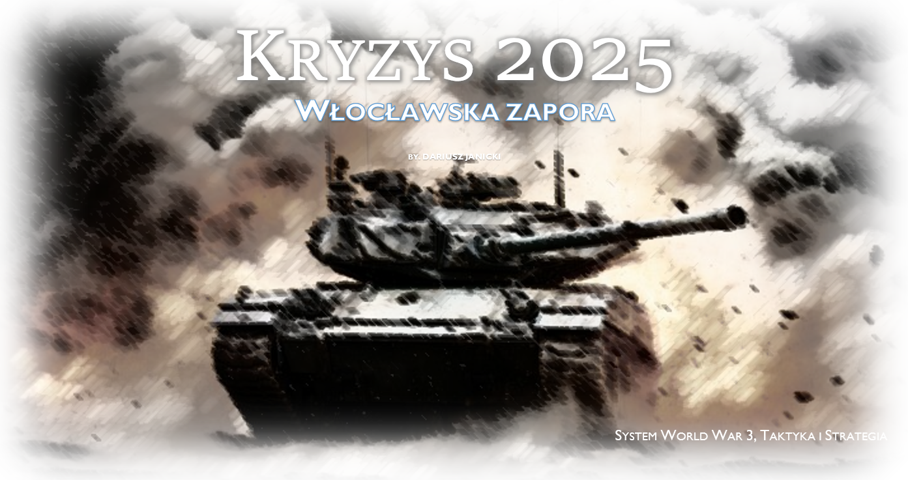

# Kryzys-2025

Kryzys 2025 to seria wirtualnych gier planszowych zrealizowanych w silniku Vassal w systemie World War 3 (WW3) wydawnictwa Taktyka i Strategia (Gry w tym systemie można kupić np. tu https://taktykaistrategia.pl/kategoria-produktu/nasze-gry/?filter_system=ww3&query_type_system=or)

Kryzys 2025 opowiada o hipotetycznej wojnie domowej w Polsce - trzy strony konfliktu

* Postępowi lojaliści z Sojuszu Europejskiego,
* Konserwatywni buntownicy z Armii Wolności, 
* Zachowawczy państwowcy z Polskiej Ligi Samoobrony

## Jak uruchamiać

* Należy otworzyć moduł "WW3 - Kryzys 2025.vmod". Jest to podstawowa wersja gry nie zawierająca żadnego scenariusza.
* Następnie należy pobrać plik *.vmdx z odpowiedniego scenariusza i zainstalować jako dodatek do modułu.

## Scenariusze

---

1️⃣ **Incydent Tarnowski**

Siły Sojuszu Europejskiego próbują zgasić zarzewie buntu w Tarnowie

---

2️⃣ **Marsz przez Magnuszew**

Sojusz Europejski i Armia Wolności ścigają się do Warszawy aby obalić albo obronić rząd, ale na drodze staje im Polska Liga Samoobrony.

---

3️⃣ **Włocławska Zapora**

  

Polska Liga Samoobrony planuje przejąć infrastrukturę krytyczną z rąk Sojuszu Europejskiego. 

---
4️⃣ **Atak na Kielce**

Garnizon Kielc broni się przed Sojuszem Europejskim w oczekiwaniu na odsiecz ze strony Armii Wolności.

---

  

* 5️⃣ Hasło "Kraków" - Sojusz Europejski uderza na stolicę buntu - Kraków. Naprzeciw stoją regularne siły Armii Wolności.

## Struktura repozytorium

* WW3 - Kryzys 2025.vmod - plik zawierający moduł Vassal
* scenarios/ - katalogi ze scenariuszami, każdy scenariusz zawiera:
  * graphics/ - grafiki związane ze scenariuszem, mapy, jednostki, okładki, screenshoty
  * scenario/ - scenariusz/kolejne scenariusze do gry z opisami i zmianami w zasadach
  * psd/ - pliki źródłowe w formacie photoshop
  * saves/ - pliki z zapisami do gry, zwykle jest to rozstawienie początkowe zgodnie ze scenariuszem
  * *.vmdx - plik z dodatkiem do głównego modułu
  * *.vmod - niektóre scenariusze mają też swój samodzielny moduł, nie dodatek
* resources/ - różne pliki, ikonki, dźwięki wspólne dla wszystkich (albo części) gier

